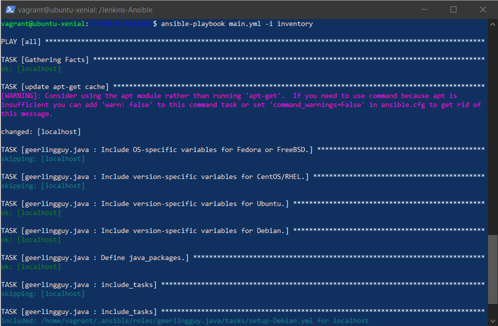
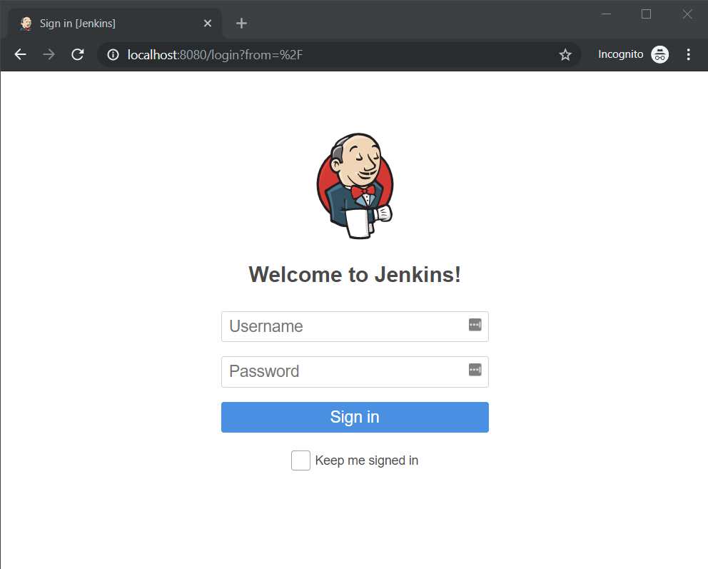

# Ansible Workshop

In this workshop, we will practice setting up a basic virtual environment and the following tasks:

* Setting up ansible and virtual machines
* Accessing a virtual machine through ssh
* Running commands through ssh
* Using ansible to manage an inventory of servers and run commands over ssh 
* Practice using ansible galaxy roles by installing `java`
* Ansible-playbooks for installing Jenkins

## Pre-reqs

You can clone this repo to get the needed files: 
```
git clone https://github.com/CSC-510/Jenkins-Ansible.git
cd Jenkins-Ansible
```

### Ansible

⚠ Warning: Ansible does not run on Windows! You'll have to install Ansible in a VM/docker container.

<!-- #### Mac/Linux

```
$ sudo easy_install pip # Can skip if already have pip
$ sudo pip install ansible
``` -->

#### Create VM for Ansible w/Baker (Ubuntu 16.04)

Ensure you're running [latest Baker version (0.7.2)](https://docs.getbaker.io/installation/).
You may need to also [update VirtualBox](https://www.virtualbox.org/wiki/Downloads), especially if you've upgraded MacOS to Mojave.

In the current directory, you will find configuration for provisioning a virtual machine using baker (`baker.yml`). It is configured to automatically install Ansible:

```yaml
name: jenkins
vm:
  ip: 192.168.14.14 # give the virtual machine an ip address
  memory: 2048 # share 2GB of memory with this virtual machine
  ports: 8080 # forwards port 8080 of the virtual machine to port 8080 on the host
tools:
  - ansible # installs ansible inside the virtual machine
commands:
  roles: ansible-playbook roles.yml
  ping: ansible all -m ping -i inventory
  install: ansible-playbook main.yml -i inventory
  remote: ssh -i jenkins_rsa vagrant@192.168.14.100
```

Simply run the command below and baker will provision the VM and install Ansible on it:
```shell
baker bake
```
Then, you can connect to the machine using ssh. Baker has an ssh command which connects to the virtual machine in your current directory:
```
baker ssh
cd /Jenkins-Ansible
```

Alternatively you could use ssh command to connect to this VM:
```
# on Windows and Linux:
ssh -i ~/.baker/baker_rsa vagrant@192.168.14.14
# on Mac:
ssh -i ~/Library/Baker/BakerForMac/baker_rsa vagrant@192.168.14.14
```

## Ansible in action

Now we have one of the main tools for automation.

Notice, we can now start running basic commands on remote servers with just ssh. However, we do not want to be stuck figuring out how to type complicated commands in shells and worry about things like escaping strings, etc. Instead, we can use tools like Ansible, which use this ssh connection to run commands on a target machine for you.

In fact Ansible has many different connectors such as localhost which runs the configuration in the current environment. For simplicity, in this workshop we use this local connector to configure the same virtual machine which is running Ansible.

### Setting up inventory file and ssh keys

An inventory file allows ansible to define, group, and coordinate configuration management of multiple machines. At the most basic level, it basically lists the names of an asset and details about how to connect to it.

A `inventory` file typically contains something like the following (**Note use your ip address and private_key**):

```ini    
[jenkins]
192.168.14.100 ansible_ssh_private_key_file=jenkins_rsa ansible_user=vagrant ansible_python_interpreter=python3
```

**But** since we use local connection in this workshop, it should contain the following:
```ini
[jenkins]
localhost ansible_connection=local
```

From your local host (or machine running ansible), run a ping test to verify you can reach your inventory!

```shell
ansible all -m ping -i inventory -vvvv
```

## Configuration Management

#### Performing configuration management
    
Let's install a web server, called nginx (say like engine-X), on the VM. The web server will automatically start.

```shell
ansible all -b -m apt -i inventory -a 'pkg=nginx state=present'
```

Open a browser and enter in your VM's ip address, e.g. http://192.168.14.14:80/

Removing nginx:
```shell
ansible all -b -m apt -i inventory -a 'pkg=nginx state=absent'
```

Actually, nginx is a metapackage, so you also need to run this:
```shell
ansible all -b -m shell -i inventory -a 'sudo apt-get -y autoremove'
```
Now if you reload the address you opened in your browser, the webserver should be dead!

#### Setting up Jenkins

* Setting up roles: `ansible-playbook roles.yml`

  This will install Ansible Galaxy roles for ansible, which makes it easier to run more advanced setup steps, such as installing Java.

* Running install: `ansible-playbook main.yml -i inventory`

  This will run all the installation tasks (Jenkins, Jenkins user configuration, etc) on the targets listed in your inventory

  

#### Verifyfing setup.

If the steps are successful, you should be able to open http://localhost:8080/ or http://192.168.14.14:8080/ in your browser:


And you can login with username = `admin` and password = `admin`.
